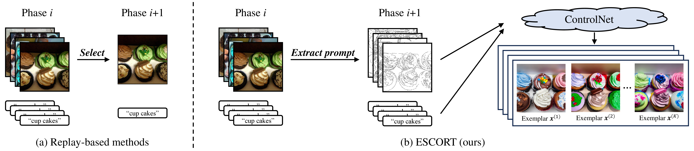

<div align="center">

  # ESCORT: Prompt-Based Exemplar Super-Compression and Regeneration for Class-Incremental Learning 

  

</div>


## Overview

Class-incremental learning (CIL) with _**E**xemplar **S**uper-**CO**mpression and **R**egeneration based on promp**T**s_ (ESCORT), a diffusion-based approach that boosts CIL performance by storing exemplars with increased quantity and enhanced diversity under limited memory budget. ESCORT works by
- extracting visual and textual prompts from selected images and saving prompts instead of images
- regenerating exemplars from prompts with ControlNet for CIL model training in subsequent phases

## Paper
Official implementation of 

<b>Prompt-Based Exemplar Super-Compression and Regeneration for Class-Incremental Learning</b>
<br/>
[Ruxiao Duan](https://scholar.google.com/citations?hl=en&user=aG-fi1cAAAAJ)<sup>1</sup>,
[Yaoyao Liu](https://scholar.google.com/citations?hl=en&user=Uf9GqRsAAAAJ)<sup>1</sup>,
[Jieneng Chen](https://scholar.google.com/citations?hl=en&user=yLYj88sAAAAJ)<sup>1</sup>,
[Adam Kortylewski](https://scholar.google.com/citations?hl=en&user=tRLUOBIAAAAJ)<sup>2,3</sup>,
[Alan Yuille](https://scholar.google.com/citations?hl=en&user=FJ-huxgAAAAJ)<sup>1</sup>,
<br/>
<sup>1</sup>Johns Hopkins University,
<sup>2</sup>University of Freiburg,
<sup>3</sup>Max Planck Institute for Informatics

## Getting Started

### 1. Environment Creation
```
git clone https://github.com/lllyasviel/ControlNet.git
conda env create -f ControlNet/environment.yaml
conda activate control
```

### 2. ControlNet Preparation
- Download ControlNet from [HuggingFace](https://huggingface.co/lllyasviel/ControlNet/tree/main/models) and save the Canny edge model (`control_sd15_canny.pth`) in `ControlNet/models/control_sd15_canny.pth`.

### 3. Data Curation
- Choose an image classification dataset and save all images in the form of
`<data-dir>/<dataset-name>/<mode>/<class-label>/<image-filename>`
  - `<data-dir>`: directory to store all datasets.
  - `<dataset-name>`: name of the dataset.
  - `<mode>`: either "train" or "test".
  - `<class-label>`: the class tag, e.g., "cupcakes".
  - `<image-filename>`: the image filename, e.g., "0001.jpg".
- If the dataset is not implemented, add it to the scripts.
  - In `utils/data.py`, set another class by specifying the dataset name and its number of categories.
  - In `utils/data_manager.py`, add a mapping from the dataset name to its class instance in `_get_idata()`.

### 4. Path Configuration
- In `compress/compress.py` and `compress/compress_lowres.py`, set `CNET_DIR` to `<pwd>/ControlNet`.
- In `compress/compress.py` and `compress/compress_lowres.py`, set `DATA_DIR` to `<data-dir>`.
- In `utils/data.py`, set `self.data_dir` to `<data-dir>`.
- In `utils/toolkit.py`, set return of `output_folder()` as path to the output folder.

### 5. Prompt Extraction and Image Generation
- We compress all the training images into edge maps and generate their copies by ControlNet in advance.
- In `compress/compress.py` and `compress/compress_lowres.py`, set `SEEDS` to seeds of your choice, e.g., `range(5)`.

- If the images are relatively high-resolution, run
```
python compress/compress.py
```
- If the images are relatively low-resolution, run
```
python compress/compress_lowres.py
```

### 6. Training Configuration
- In `exps/config.json` set training parameters. Most configurations follow the convention of [PyCIL](https://github.com/G-U-N/PyCIL), except:
  - `augmentation_prob`: the probability of replacing a real image during one of its generated copies during training.
  - `augmentations_per_image`: the number of generated copies per image.
  - `memory_per_class`: memory budget in units per class.
  - `real_per_class`: number of real exemplars per class.
  - `syn_per_class`: number of synthetic exemplars per class.
- For instance, if we can set `memory_per_class=20`, `real_per_class=18`, and `syn_per_class=48`.

### 7. CIL Model Training
```
python main.py
```

## Acknowledgement

The CIL framework is developed based on [PyCIL](https://github.com/G-U-N/PyCIL).

